# WhoopDock 6 Pro

## Introduction

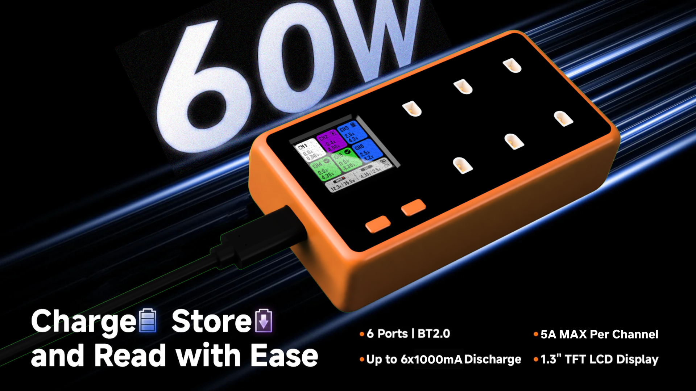

*Up to 130W when powered with VBUS pads

This is my custom BT2.0 battery charger! I started this project because I wanted a programmable 1S LiPo/LiHV multi channel charger that included discharging and storage mode. Commercial chargers like the hexachargers or whoopstor has all the mentioned features but it's limited and lack customizability.

This charger is designed primarily for use with tinywhoop FPV drone batteries using the BetaFPV BT2.0 connector, but its 5A charge current also allows it to be used with larger cylindrical cell batteries for long range drones.

| Feature | WhoopDock 6 Pro | BetaFPV Hexacharger | ViFly WhoopStor V3 |
| --- | --- | --- | --- |
| **Max Charge Current (Per Channel)** | **Up to 5A**  | 3.0A | 1.3A |
| **Max Discharge Current (Per Channel)** | **1.16A** | 0.4A | 0.3A |
| **Custom Discharge Current** | **Yes**  | No | No |
| **Target Voltage Control** | **Fully Customizable** | Presets Only | Presets Only |
| **Voltage Increments** | **16mV** | None (3.85V/4.2V/4.35V) | None (3.8V/3.85V/4.2V/4.35V) |
| **Current Increments** | **64mA** | 500mA | 100mA |
| **Big Colour Screen** | **Yes** | **Yes** | No |
| **Programmability** | **Yes** (Arduino compatible) | No (Closed source) | No (Closed source) |
| **WiFi & Bluetooth** | **Yes** | No | No |
| **Audio Feedback** | **Yes** | **Yes** | **Yes** |
| **Active Cooling** | **Yes** (Programmable curve) | **Yes** | **Yes** |
| **Reverse Polarity Protection** | **Yes** | No | **Yes** |

If you don't like how it works, you could always program it to replicate the behavior of your favorite charger.

### Advantages:

* **Current Delivery & Discharging:** The WhoopDock is much more powerful when compared to commercial options. With the BQ25890, you can charge large batteries up to 5A, and has small 64mA interval to precisely control the charge current of small batteries. The 1.16A discharge rate means your large batteries will hit storage voltage significantly faster, and can be adjusted to a lower current for smaller batteries.
* **Granular Control:** Instead of being locked into specific presets, the 16mV step resolution allows you to charge different battery chemistries or set a custom charge termination voltage.
* **Connectivity:** Having Bluetooth and WiFi onboard allows you to monitor charge cycles from your phone, and receive push notifications when charging is complete.

---

## Hardware Specifications

* **MCU:** ESP32-S3-WROOM-1-N8
* **Charge Controller:** 6x TI BQ25890
* **I2C Multiplexer:** TCA9548A
* **PD Negotiation:** CH224K
* **Display:** 1.3" 240x240 ST7789 TFT
* **Power Supply:** XL1509-5.0E1 5V Buck Converter, 2x RT9193 3.3v LDO (One for ESP32 and another to power the display)
* **Active Cooling:** 5V 4010 blower fan and dual 60x20x10mm aluminum heatsinks
* **Protection:** AO4407A P Channel MOSFETs for battery reverse polarity insertion protection

Note: The BQ25890 has a maximum input voltage limit of 14V. The CH224K is configured to negotiate 12V for optimal performance. Do not bridge the 15V or 20V jumpers on the PD controller. Only use 2-3s batteries on the VBUS input pads.

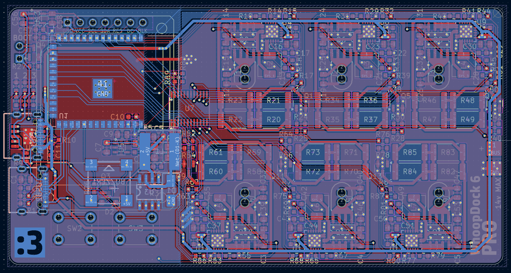
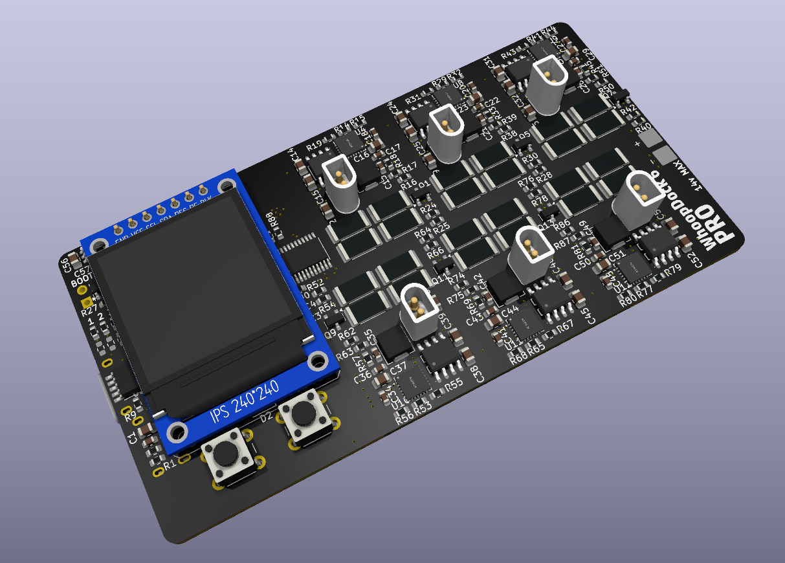

---

> [!WARNING]
> **DO NOT USE THE OCTAL PSRAM VERSION OF THE ESP32S3.** The octal version uses GPIO35, 36 and 37 for memory which overlap with the GPIOs used in the charger. Use QUAD SPI versions otherwise the ESP32 will fail to boot.

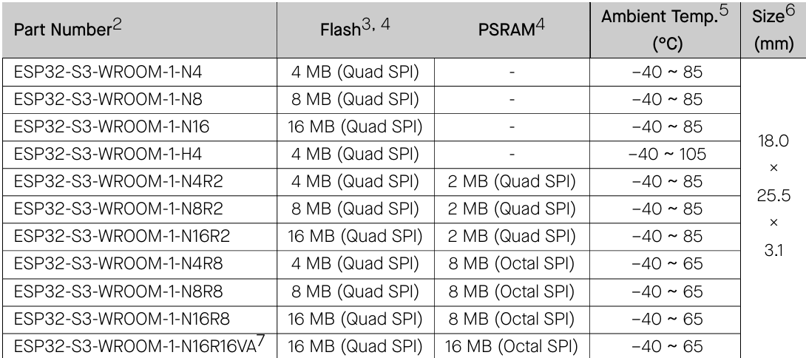

## Ports and Interfaces

### External Connections

* **Main Power (Protruding USB-C):** This is the primary power input and supports up to 12v 5A (60W)
* **Programming (Flush USB-C):** Connected directly to the ESP32 USB data pins for programming. Cannot be accessed while inside the case.
* **Direct Power Pads:** Exposed solder pads on the PCB to bypass the USBC port entirely. Solder XT30 connectors here to bypass the power limit of USB C

### Pinout

| Component | Pin Name | ESP32S3 GPIO | Description |
| --- | --- | --- | --- |
| **TFT Display** | `SCL`| GPIO 35 | SPI Clock |
|  | `TFT_SDA`| GPIO 36 | SPI Data |
|  | `TFT_RES` | GPIO 37 | Display Reset |
|  | `TFT_DC` | GPIO 38 | Data / Command |
|  | `TFT_BLK` | GPIO 39 | Backlight Control |
| **I2C Bus** | `MAIN_SDA` | GPIO 47 | Main I2C Data (TCA9548A MUX) |
|  | `MAIN_SCL` | GPIO 48 | Main I2C Clock (TCA9548A MUX) |
| **User Interface** | `SW_LEFT` | GPIO 8 | Left Button (Active Low) |
|  | `SW_RIGHT` | GPIO 18 | Right Button (Active Low) |
|  | `BUZZER` | GPIO 17 | Passive Buzzer |
| **Cooling** | `FAN` | GPIO 40 | 4010 Fan PWM Power |

*Note: The CE pins are pulled high by 5.1k resistors.*

|Battery Channel | Charge Enable GPIO | Discharge PWM GPIO | TCA9548A MUX Port |
| --- | --- | --- | --- |
| **Channel 1** | GPIO 43 | GPIO 41 | Port 6 |
| **Channel 2** | GPIO 2 | GPIO 42 | Port 5 |
| **Channel 3** | GPIO 1 | GPIO 44 | Port 4 |
| **Channel 4** | GPIO 12 | GPIO 13 | Port 1 |
| **Channel 5** | GPIO 11 | GPIO 14 | Port 2 |
| **Channel 6** | GPIO 10 | GPIO 21 | Port 3 |

---

## Firmware Setup

The current firmware is for connection validation only, and isn't production ready yet
### How to flash the firmware

1. **Connect to the Programming Port:** Plug a USBC cable into the flush USBC port (not the protruding power port).
2. **Open Arduino IDE:** Load `firmware/firmware.ino`.
3. **Select Board:** Choose "ESP32S3 Dev Module". Ensure "USB CDC On Boot" is enabled to view the serial monitor for debugging.
4. **Flash:** Click upload. The firmware will initialize the ST7789 display, ramp up and down the fan and buzzer, scans the I2C multiplexer ports and then reports the status of all BQ25890 to the serial monitor.

---

## Case Assembly

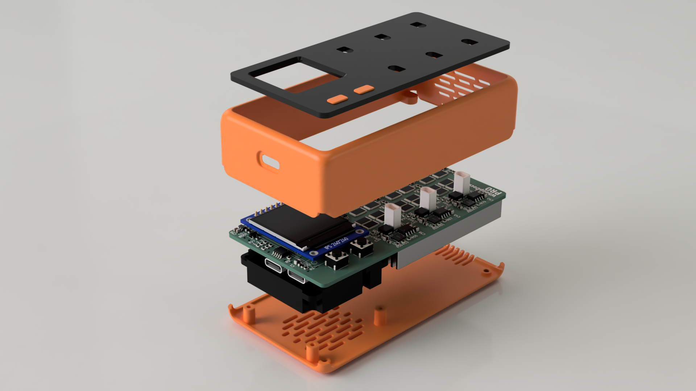
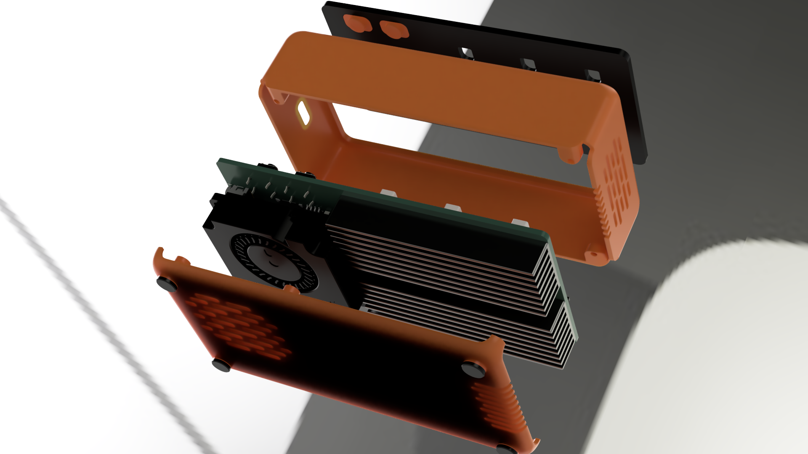

### 3D Printed Parts

All STL files for the case is in `/production/3dPrint/`.

* `bottomCase.stl`
* `topCase.stl`
* `Buttons.stl`
* `Feets.stl`

### Assembly

To fit the heatsinks properly, the bottom side of the PCB must be flat for proper contact

1. Trim the BetaFPV BT2.0 connector legs. Make a test fit **before** soldering to ensure it's not protruding.
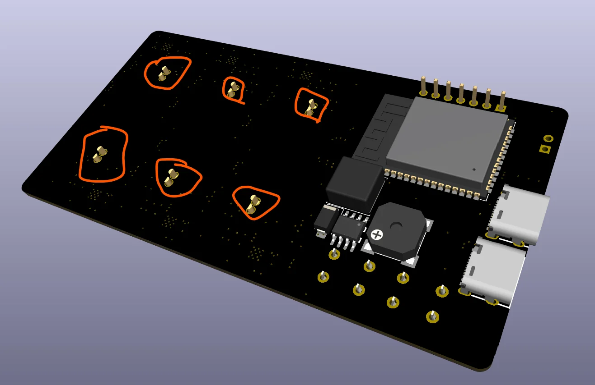
2. Place the 3D printed `Buttons.stl` into the holes on `topCase.stl`.
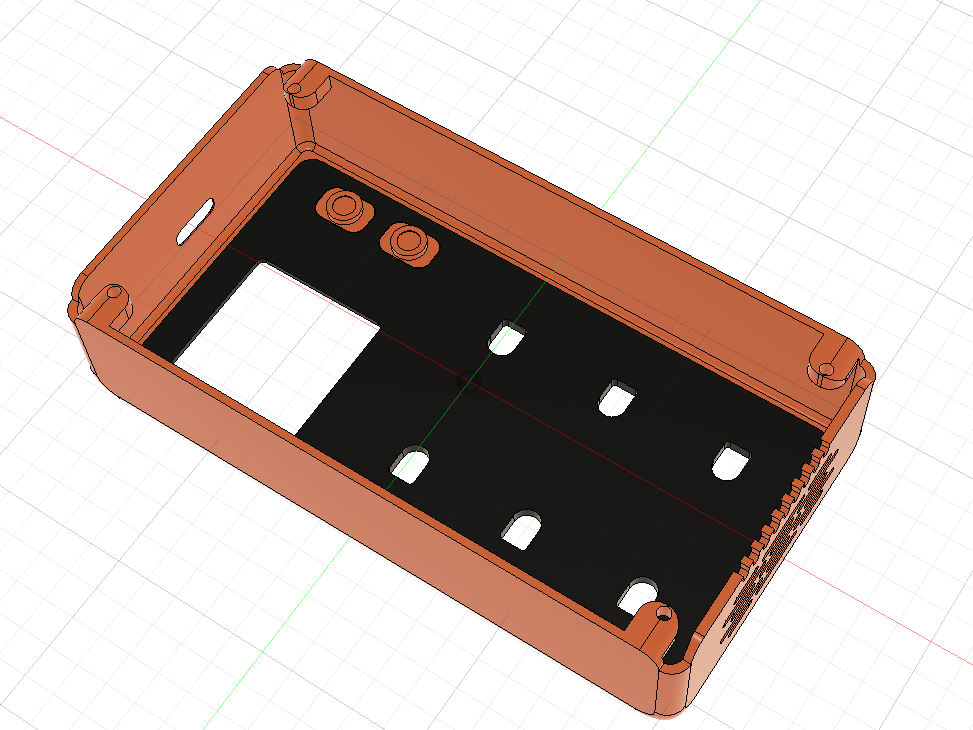
3. Screw in the 4010 blower fan into the bottom case using 4x M2x6mm screws.
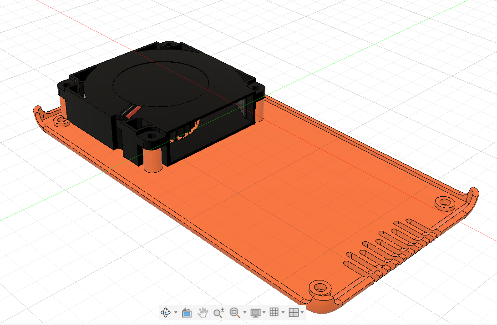
4. Snap the PCB into the top case.
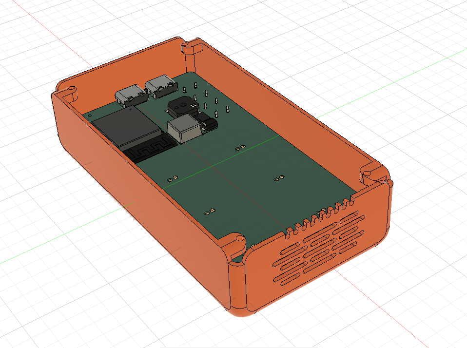
5. Apply thermal adhesives on the two heatsink and attach to the PCB.
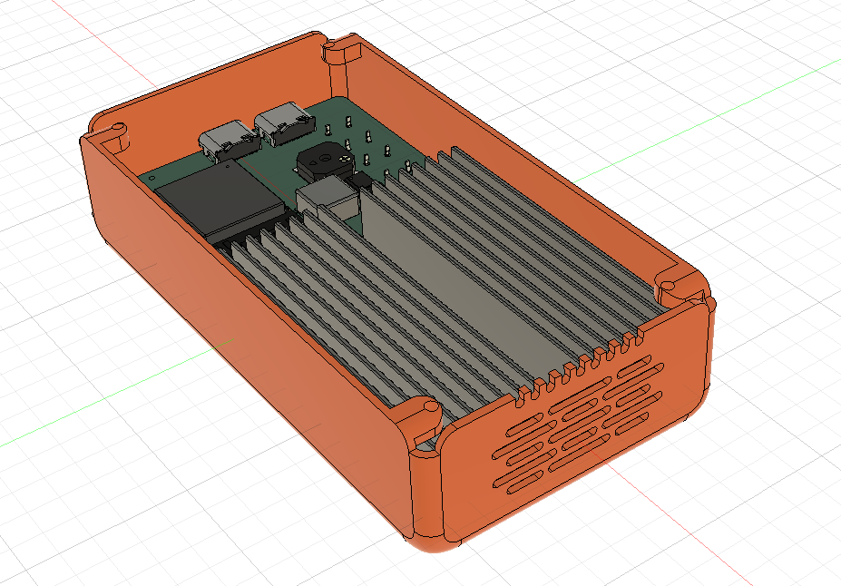
6. Secure the bottom case onto the top case and screw in using 4x M2x6mm screws. Remember to solder the solder the fan wires before closing the case.
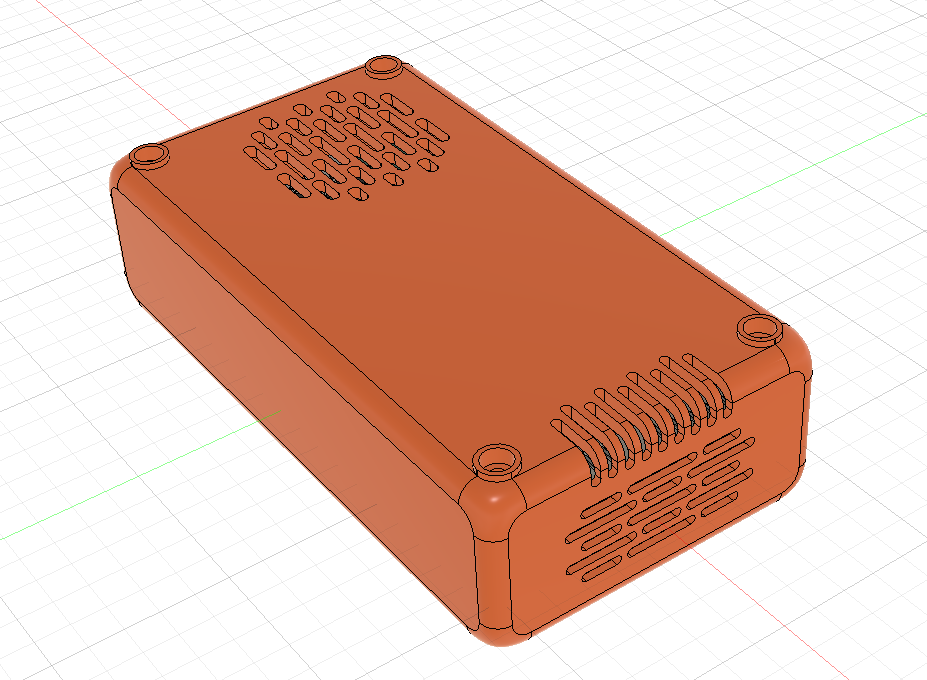
7. Attach the TPU  `Feets.stl` to the bottom to cover the screws and prevent sliding. You may use glue to keep the feets in.
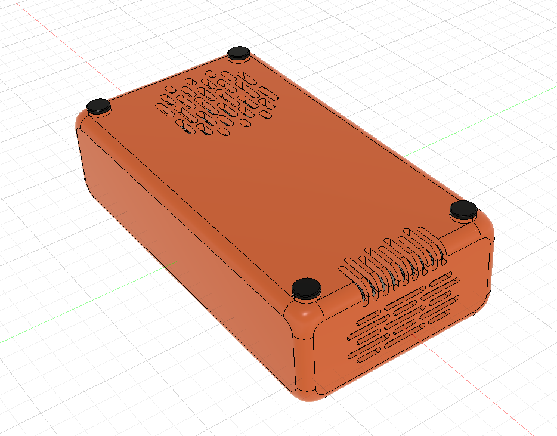

---

## Bill of Material

Note: The prices in USD are converted as of 13 August 2026 and prices may fluctuate. Promo codes will be applied before checkout to bring the costs down.

| Item Name | Link | Vendor | Quantity | Total Price (USD) |
| --- | --- | --- | --- | --- |
| Heatsink 60x20x10mm | [Link](https://shopee.com.my/Heatsink-40x40x11-mm-Aluminium-Clear-Black-Gold-Anodized-i.6674515.812567757) | Shopee | 2 | 0.85 |
| MLT8530 Buzzer 5v | [Link](https://shopee.com.my/5Pcs-SMD-Magnetic-Piezo-Loudspeaker-Speaker-Buzzer-8630-1109-9045-9025-9018-5020-1230-9032-7525-8630-8540-Passive-9650-Active-i.1649836180.27542857025) | Shopee | 1 | 1.45 |
| Capacitor 100nF 50v (0603) | [Link](https://www.google.com/search?q=https://shopee.com.my/100pcs-0603-1608-SMD-Chip-Multilayer-Ceramic-Capacitor-0.1pF-22uF-10pF-22pF-100pF-1nF-10nF-15nF-100nF-0.1uF-1uF-2.2uF-4.7uF-10-i.1649836180.27542857041) | Shopee | 1 | 0.90 |
| Capacitor 10nF 50v (0603) | [Link](https://www.google.com/search?q=https://shopee.com.my/100pcs-0603-1608-SMD-Chip-Multilayer-Ceramic-Capacitor-0.1pF-22uF-10pF-22pF-100pF-1nF-10nF-15nF-100nF-0.1uF-1uF-2.2uF-4.7uF-10-i.1649836180.27542857041) | Shopee | 1 | 0.98 |
| Capacitor 1uF 25v (0603) | [Link](https://www.google.com/search?q=https://shopee.com.my/100pcs-0603-1608-SMD-Chip-Multilayer-Ceramic-Capacitor-0.1pF-22uF-10pF-22pF-100pF-1nF-10nF-15nF-100nF-0.1uF-1uF-2.2uF-4.7uF-10-i.1649836180.27542857041) | Shopee | 1 | 0.91 |
| Capacitor 47nF 50v (0603) | [Link](https://www.google.com/search?q=https://shopee.com.my/100pcs-0603-1608-SMD-Chip-Multilayer-Ceramic-Capacitor-0.1pF-22uF-10pF-22pF-100pF-1nF-10nF-15nF-100nF-0.1uF-1uF-2.2uF-4.7uF-10-i.1649836180.27542857041) | Shopee | 1 | 0.94 |
| Capacitor 4.7uF 16v (0603) | [Link](https://www.google.com/search?q=https://shopee.com.my/100pcs-0603-1608-SMD-Chip-Multilayer-Ceramic-Capacitor-0.1pF-22uF-10pF-22pF-100pF-1nF-10nF-15nF-100nF-0.1uF-1uF-2.2uF-4.7uF-10-i.1649836180.27542857041) | Shopee | 1 | 1.50 |
| Capacitor 10uF 25v (0805) | [Link](https://www.google.com/search?q=https://shopee.com.my/100pcs-0805-SMD-Chip-Multilayer-Ceramic-Capacitor-0.5pF-47uF-10pF-22pF-100pF-1nF-10nF-100nF-0.1uF-1uF-2.2uF-4.7uF-10uF-22uF-i.1649836180.56864018438) | Shopee | 1 | 3.86 |
| Tantalum Capacitor 33uF 10v (A) | [Link](https://www.google.com/search?q=https://shopee.com.my/10Pcs-3216A-SMD-Tantalum-Capacitor-100-220-330-470-1UF-2.2UF-3.3UF-4.7UF-6.8UF-22UF-33UF-47UF-100UF-4V-6.3V-10V-16V-20V-25V-35V-i.1649836180.55607396414) | Shopee | 1 | 1.90 |
| Diode SS14 | [Link](https://www.google.com/search?q=https://shopee.com.my/10-Pieces-SB1045L-SB10100L-SL1045-B240A-SS12-SS14-SS16-SS24-SS26-SS34-SS36-SS54-SS56-SS110-SS210-SS2200-DSK16-DSK24-DSK26-i.1649836180.47204908404) | Shopee | 1 | 0.82 |
| Inductor 1uH (0420) | [Link](https://www.google.com/search?q=https://shopee.com.my/5PCS-SMD-Molding-Power-Inductors-0420-0520-0530-0630-0650-1040-1265-1R0-2R2-6R8-1UH-2.2-3.3-4.7-6.8-33-100UH-2.2UH-Inductance-i.1649836180.45952518693) | Shopee | 2 | 2.10 |
| Resistor 5.1k (0603) | [Link](https://www.google.com/search?q=https://shopee.com.my/200pcs-0603-5-SMD-Resistor-0R-~-10M-1-10W-10-100-150-220-330-470-ohm-1K-2.2K-4.7K-10K-100K-1M-1R-10R-100R-150R-220R-330R-470R-i.1649836180.57850021816) | Shopee | 1 | 0.75 |
| Resistor 10k (0603) | [Link](https://www.google.com/search?q=https://shopee.com.my/200pcs-0603-5-SMD-Resistor-0R-~-10M-1-10W-10-100-150-220-330-470-ohm-1K-2.2K-4.7K-10K-100K-1M-1R-10R-100R-150R-220R-330R-470R-i.1649836180.57850021816) | Shopee | 1 | 0.75 |
| Resistor 1k (0603) | [Link](https://www.google.com/search?q=https://shopee.com.my/200pcs-0603-5-SMD-Resistor-0R-~-10M-1-10W-10-100-150-220-330-470-ohm-1K-2.2K-4.7K-10K-100K-1M-1R-10R-100R-150R-220R-330R-470R-i.1649836180.57850021816) | Shopee | 1 | 0.75 |
| Resistor 100 (0603) | [Link](https://www.google.com/search?q=https://shopee.com.my/200pcs-0603-5-SMD-Resistor-0R-~-10M-1-10W-10-100-150-220-330-470-ohm-1K-2.2K-4.7K-10K-100K-1M-1R-10R-100R-150R-220R-330R-470R-i.1649836180.57850021816) | Shopee | 1 | 0.75 |
| ESP32-S3-WROOM-1-N8 | [Link](https://www.google.com/search?q=https://shopee.com.my/1Pcs-ESP32-S3-ESP32-S3-WROOM-1-1U-ESP32-S3-MINI-1U-4MB-8MB-16MB-N4-N4R2-N4R8-N8-N8R2-N8R8-N16-N16R2-N16R8-WiFi-Ble-5.0-Module-i.1649836180.43173884048) | Shopee | 1 | 6.02 |
| USBC Connector | [Link](https://www.google.com/search?q=https://shopee.com.my/5Pcs-USB-Type-C-3.1-2-6-16-24-Pin-Connector-Female-Jack-Charging-Port-SMD-SMT-PCB-Solder-DIY-Repair-USB-C-Type-C-Socket-i.1649836180.45502078939) | Shopee | 1 | 0.85 |
| Resistor 15 (2512) | [Link](https://www.google.com/search?q=https://shopee.com.my/(20pcs)-2512-SMD-Resistor-0.1R~910R-5-0.2R-0.15R-0.25R-0.22R-0.47R-0R-1R-1.5R-5.1R-2.2R-4.7R-10R-22R-47R-50R-100R-220R-330R-470R-Ohm-Resistance-i.475340513.28383894995) | Shopee | 2 | 1.24 |
| BetaFPV BT2.0 Connector | [Link](https://shopee.com.my/1-Pair-BETAFPV-BT2.0-Connector-BTC2.0-i.92575144.7717088511) | Shopee | 6 | 7.34 |
| N Channel Mosfet AO3400A | [Link](https://www.google.com/search?q=https://shopee.com.my/50pcs-AO3400-SOT23-AO3400A-SOT-23-A09T-SOT-AO3401-AO3402-AO3404-AO3406-AO3407-AO3415-AO3416-SMD-Field-Effect-Management-i.1135937572.24257651124) | Shopee | 1 | 0.85 |
| P Channel Mosfet AO4007A | [Link](https://shopee.com.my/10pcs-lot-AO4407AL-AO4407A-AO4407-4407A-4407-SOP8-30V-12A-P-Channel-MOSFET-In-Stock-i.304553259.7152107243) | Shopee | 1 | 0.92 |
| XL1509-5.0E1 | [Link](https://shopee.com.my/10-PCS-XL1509-ADJE1-XL1509-ADJ-XL1509-5.0E1-XL1509-5.0-XL1509-3.3E1-XL1509-3.3-XL1509-SOP-8-In-Stock-i.304553259.23988849871) | Shopee | 1 | 1.65 |
| BQ25890 | [Link](https://www.google.com/search?q=https://shopee.com.my/5PCS-BQ25601-BQ25890-QFN-BQ25890H-BQ25896-BQ25892RTWR-BQ-series-charging-ics-IC-i.1592750725.44459693293) | Shopee | 2 | 10.00 |
| I2C Multiplexer TCA9548 | [Link](https://shopee.com.my/CJMCU-9548-TCA9548-TCA9548A-1-to-8-I2C-8-way-multi-channel-Expansion-Board-IIC-Module-i.927139050.23724940668) | Shopee | 1 | 0.84 |
| 1.3" TFT Display | [Link](https://shopee.com.my/TFT-Display-0.96-1.3-1.44-Inch-IPS-7P-SPI-HD-65K-Full-Color-LCD-Module-ST7735-Drive-IC-80*160-(Not-OLED)-For-Arduino-i.509537957.11442443894) | Shopee | 1 | 2.72 |
| PCB |  | JLCPCB | 1 | 2.00 |
| SPX Express Shipping |  | Shopee | 9 | 11.45 |
| PCB Shipping |  | JLCPCB | 1 | 1.50 |
| **GRAND TOTAL** |  |  |  | **66.59** |